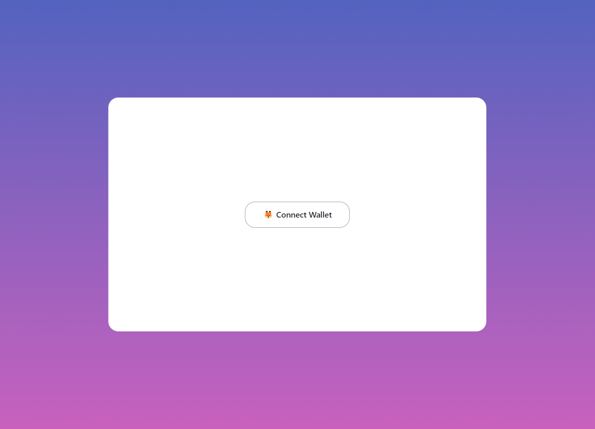

# USDTM-wallet

## 📑 Overview

This project allows users to connect their MetaMask wallet and perform the following actions with a specified token (USDTM):

- 🦊 Connect Metamask wallet: Users can connect their MetaMask wallet to the application.
- 🪙 Call the Mint method: Users can initiate a "Mint" transaction.
- ⏰ Waiting for the transaction to complete: The application will notify users to wait for the transaction to complete.
- 🔄 Balance update after transaction: Once the transaction is completed, the user's balance is updated accordingly.


## 🛠 Getting Started

To get started with this project, follow these steps:

### 📔Clone the repository:

```bash
git clone https://github.com/KarinaOlenina/usdtm-wallet.git
```
### 📦 Install dependencies using Yarn:

```bash
yarn install
```

### 🚀 Start:

```bash
yarn start
```

The app will be accessible at http://localhost:3000 in your web browser.



## 🤐 .env File

Make sure to create a .env file in the project root directory with the following environment variable:

```bash
REACT_APP_DEV_TOKEN_CONTRACT_ADDRESS=
```
This environment variable is used to specify the development token contract address.


## 🌐 MetaMask Network Configuration

Before using the application, make sure to configure the MetaMask network settings to connect to the Polygon Mumbai testnet with the following details:
```bash
Network Name: Polygon Mumbai Testnet
New RPC URL: https://endpoints.omniatech.io/v1/matic/mumbai/public
Chain ID: 80001
Currency Symbol: MATIC
```
These settings will allow you to connect to the Polygon Mumbai testnet and use the application with the specified RPC endpoint and network configuration.


## 🧑‍💻 Testing

You can run tests using the following command:

```bash
yarn test
```
This command launches the test runner in interactive watch mode for running tests.

